<table align="center">
    <th>
        Currently Reading
    </th>
    <th>
      &nbsp;
    </th>
    <tr>
      <td></td>
      <td><a href="https://beej.us/guide/bgnet/">Beej's Guide to Network Programming in C</a></td>
    </tr>
    <th>
        Completed
    </th>
    <th>
      &nbsp;
    </th>
    <tr>
        <td></td>
        <td><a href="https://datatracker.ietf.org/doc/html/rfc793">RFC 793</a></td>
    </tr>
</table>

[./Hackathon_Dev](https://github.com/oZep/oZep/blob/main/hackathon-dev.md)

[./LLM_Breakdown](https://github.com/oZep/oZep/blob/main/llm-breakdown.md)

[./Computer_Vision](https://github.com/oZep/oZep/blob/main/computer-vision-proj.md)

[./Game_Dev](https://github.com/oZep/oZep/blob/main/game-dev-proj.md)
