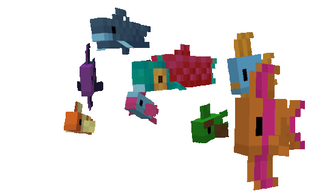

		
  

		
		
	

<table align="center"><tr><th>Languages</th><th>Frameworks</th><th>Developer Tools</th><th>Actively Using</th></tr>
<tr><td colspan="1" align="center"></td><td colspan="1" align="center"></td><td colspan="1" align="center"></td><td colspan="1" align="center"></td></tr>
</table>

	
	
	
	

